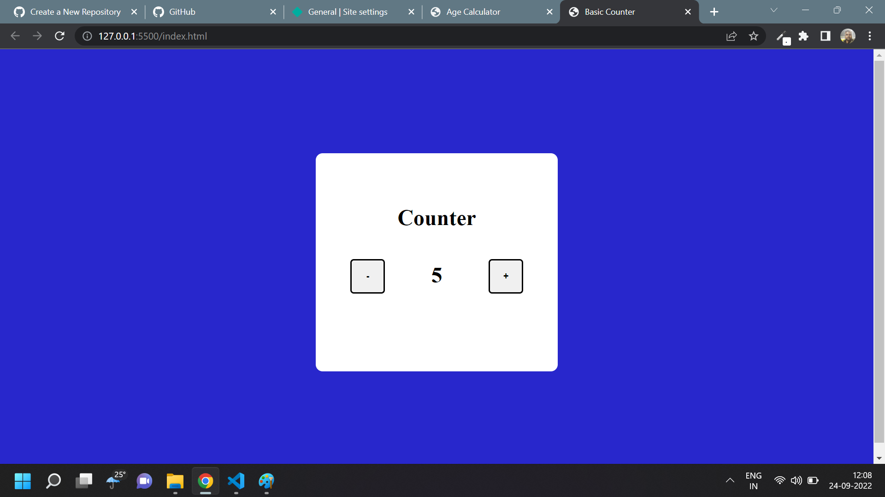

# Javascript Assignment Basic Counter

## Basic Counter [Live Link](https://name-conversion-js.netlify.app/)

- Skills Gained in this project

  - increase and decrease value on button click

---

## Time taken to finish this project

- 5 minutes to complete it

#### Screenshot

